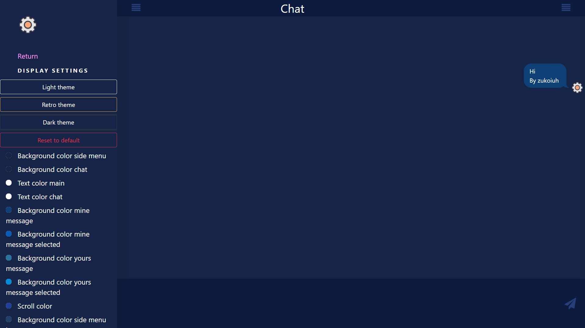

# Spring-Messenger
**Goals:**

- Create your own messenger
- Make it look like a telegram
- Add some feature to it that conceptually distinguishes it from others

 ****
You can choose between dark, retro, and light themes:

 ****
Also, if you want to change the design in detail, then you will have such an opportunity

 ****